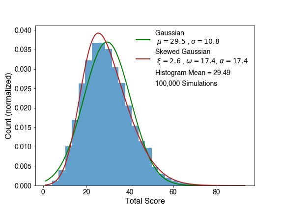

https://fivethirtyeight.com/features/can-you-turn-americas-pastime-into-a-game-of-yahtzee/

## Problem Statement:

Over the years, people have invented many games that simulate baseball using two standard dice. In these games, each dice roll corresponds with a baseball event. Two players take turns rolling dice and tracking what happens on the field. Suppose you happen to be an ardent devotee of one of these simulated games from the late 19th century, called Our National Ball Game, which assigns rolls to baseball outcomes like so:

1, 1: double\
1, 2: single\
1, 3: single\
1, 4: single\
1, 5: base on error\
1, 6: base on balls\
2, 2: strike\
2, 3: strike\
2, 4: strike\
2, 5: strike\
2, 6: foul out\
3, 3: out at 1st\
3, 4: out at 1st\
3, 5: out at 1st\
3, 6: out at 1st\
4, 4: fly out\
4, 5: fly out\
4, 6: fly out\
5, 5: double play\
5, 6: triple\
6, 6: home run

Given those rules, what’s the average number of runs that would be scored in nine innings of this dice game? What’s the distribution of the number of runs scored? (Histograms welcome.) You can assume some standard baseball things, like runners scoring from second on singles and runners scoring from third on fly outs.

## Solution Histogram with fits:

## Directory Content:

**simulator.py** - Script to simulate n number of games, where n is the argument given

**score_analysis.ipynb** - Just makes the plot shown above

Some notes in developing the simulation -

Does a runner on first score with a double?
[This article](https://www.beyondtheboxscore.com/2014/4/21/5631146/chicago-white-sox-adam-dunn-score-from-first-on-double) shows that they do at a rate of just over 40 percent. So I'll throw a random number between 0 and 100 and if it's greater than that, I'll say they score. Otherwise they go to third.

Handling double plays - this is sort of a weird way to progress the game, since a double play isn't always possible. So what we're going to do is try to make it as real as possible.
- If there's nobody on base, we'll issue a normal out
- If there's a force out available, we'll put out the two runners furthest along the base path (e.g. if 1b and 2b are occupied, then outs are at 3rd and 2nd)
- If there's not a force out available but someone on base, for now we should just assume that they only get the out at first since that's *by far* the most likely scenario. Could do a study at rate at which this happens but that's a lot for a puzzle.
- Also assume no advancement for other runners in a double play

Also I created new scenario for 3 strikes rolled in a row in advancing the state called "strike out" to be asserted to the game but this effectively just works like a foul out - increases number of outs without advancing any runners, doesn't change any sort of conditions from the problem.