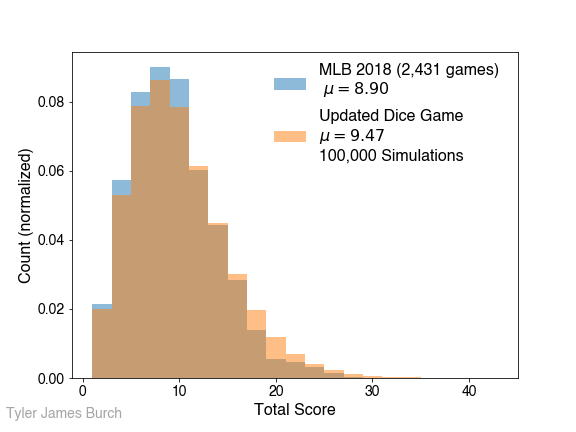

https://fivethirtyeight.com/features/can-you-turn-americas-pastime-into-a-game-of-yahtzee/

## Riddler Express:

Over the years, people have invented many games that simulate baseball using two standard dice. In these games, each dice roll corresponds with a baseball event. Two players take turns rolling dice and tracking what happens on the field. Suppose you happen to be an ardent devotee of one of these simulated games from the late 19th century, called Our National Ball Game, which assigns rolls to baseball outcomes like so:

1, 1: double\
1, 2: single\
1, 3: single\
1, 4: single\
1, 5: base on error\
1, 6: base on balls\
2, 2: strike\
2, 3: strike\
2, 4: strike\
2, 5: strike\
2, 6: foul out\
3, 3: out at 1st\
3, 4: out at 1st\
3, 5: out at 1st\
3, 6: out at 1st\
4, 4: fly out\
4, 5: fly out\
4, 6: fly out\
5, 5: double play\
5, 6: triple\
6, 6: home run

Given those rules, what’s the average number of runs that would be scored in nine innings of this dice game? What’s the distribution of the number of runs scored? (Histograms welcome.) You can assume some standard baseball things, like runners scoring from second on singles and runners scoring from third on fly outs.

### __Solution__ -

A simulation of the game was developed and ran 100,000 times. To see the code of the simulation, see simulator.py. For notes on rationale and assumptions in the simulation, see below. The following histogram shows the outcome of the runs:

Initially I assumed a Poisson distribution would fit this histogram, however I was unable to get it to converge. A gaussian and skewed gaussian were both attempted as solutions, the skew gaussian fits the data better:

## Riddler Classic:

Figuring the statistical outcomes of the 130-year-old game described in Riddler Express may be a bit outdated, so you decide that you can do better. You get to work making your own list of dice rolls, tweaking what corresponds to each roll to better match the real distributions of baseball run scores. You should be using that same set of standard baseball assumptions about when runners score (sacrifice flies, runners scoring from second, etc.).

Once you’ve matched the run-scoring environment, try to add other variables to your computations. What if you try to simulate strikeouts per game, batting average, etc.?

In other words, how closely can you simulate the grand, yet subtle, complexities of the national pastime using only a pair of cubes? What does your roll list look like?

### __Solution__ - 

Extending the philosophy from the express portion, the figure of merit for my solution is intended to be the mean and distribution of runs scored in a real MLB game. A solution was obtained by taking MLB data from 2018 using Statcast. First, to get close to the answer, assuming the simulation is written fine, mirroring the rates of the real life outcomes to the dice roll outcomes should get close to the solution. I found the rates of various events in real baseball and how frequently they occurred with respect to each other. Using this method, I was able to fill out all but 5 of the dice rolls. Since this should be ~close to the real mean I just tried to cancel out those by putting 3 good, 1 base events (singles, base on balls), and 2 bad events (outs). From there I ran the simulation, plotted the histogram, then tuned the last couple of outcomes to get the mean as close as possible. This work process can be seen in classic_solution.ipynb. The final result:

 (1, 1): 'triple'\
 (2, 2): 'base on error'\
 (3, 3): 'double play'\
 (4, 4): 'home run'\
 (5, 5): 'double'\
 (6, 6): 'strike out'\
 (1, 2): 'strike out'\
 (1, 3): 'strike out'\
 (1, 4): 'base on balls'\
 (1, 5): 'single'\
 (1, 6): 'single'\
 (2, 3): 'fly out'\
 (2, 4): 'fly out'\
 (2, 5): 'fly out'\
 (2, 6): 'fly out'\
 (3, 4): 'fly out'\
 (3, 5): 'fly out'\
 (3, 6): 'strike out'\
 (4, 5): 'single'\
 (4, 6): 'base on balls'\
 (5, 6): 'single'

\* note that "fly out" can equally be substituted for "foul out," "out at 1st", or "strike out" for the simulation, and thus the game.

With this dictionary, the result is:

## Simulation Notes:

Does a runner on first score with a double?
[This article](https://www.beyondtheboxscore.com/2014/4/21/5631146/chicago-white-sox-adam-dunn-score-from-first-on-double) shows that they do at a rate of just over 40 percent. So I'll throw a random number between 0 and 100 and if it's greater than that, I'll say they score. Otherwise they go to third.

Handling double plays - this is sort of a weird way to progress the game, since a double play isn't always possible. So what we're going to do is try to make it as real as possible.
- If there's nobody on base, we'll issue a normal out
- If there's a force out available, we'll put out the two runners furthest along the base path (e.g. if 1b and 2b are occupied, then outs are at 3rd and 2nd)
- If there's not a force out available but someone on base, for now we should just assume that they only get the out at first since that's *by far* the most likely scenario. Could do a study at rate at which this happens but that's a lot for a puzzle.
- Also assume no advancement for other runners in a double play

Also I created new scenario for 3 strikes rolled in a row in advancing the state called "strike out" to be asserted to the game but this effectively just works like a foul out - increases number of outs without advancing any runners, doesn't change any sort of conditions from the problem.

## Directory Content:

**simulator.py** - Script to simulate N number of games, where N is the argument given.

**score_analysis.ipynb** - Makes the riddler express histograms.

**classic_solution.ipynb** - Methodology for solving the Riddler classic as described above.

## other plots

Other tried fits:

