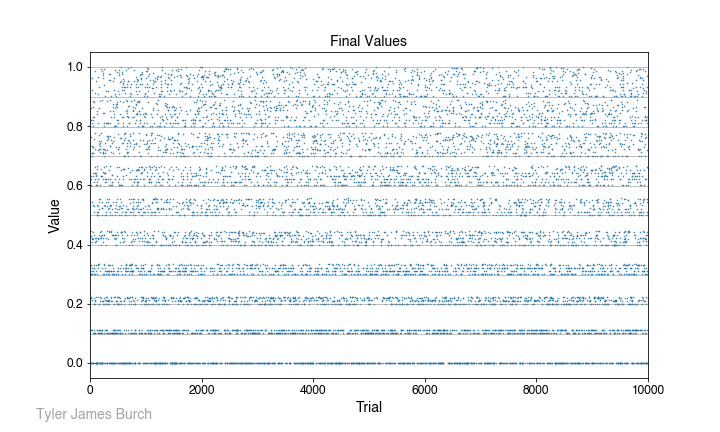
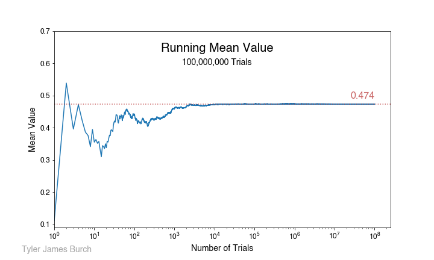
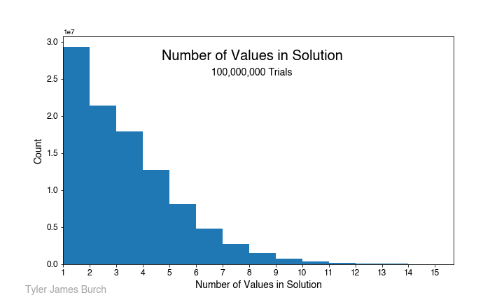

[Original problem page](https://fivethirtyeight.com/features/how-low-can-you-roll/)

## Riddler Classic:

You are given a fair, unweighted 10-sided die with sides labeled 0 to 9 and a sheet of paper to record your score. (If the very notion of a fair 10-sided die bothers you, and you need to know what sort of three-dimensional solid it is, then forget it — you have a random number generator that gives you an integer value from 0 to 9 with equal probability. Your loss — the die was a collector’s item.)

To start the game, you roll the die. Your current “score” is the number shown, divided by 10. For example, if you were to roll a 7, then your score would be 0.7. Then, you keep rolling the die over and over again. Each time you roll, if the digit shown by the die is less than or equal to the last digit of your score, then that roll becomes the new last digit of your score. Otherwise you just go ahead and roll again. The game ends when you roll a zero.

For example, suppose you roll the following: 6, 2, 5, 1, 8, 1, 0. After your first roll, your score would be 0.6, After the second, it’s 0.62. You ignore the third roll, since 5 is greater than the current last digit, 2. After the fourth roll, your score is 0.621. You ignore the fifth roll, since 8 is greater than the current last digit, 1. After the sixth roll, your score is 0.6211. And after the seventh roll, the game is over — 0.6211 is your final score.

What will be your average final score in this game?

### __Solution__ - 0.474

This problem is relatively straightforward, throwing a random number sequentially and adding to the solution integer if it meets all the conditions. This is fairly straightforward in python, the code for which can be seen in the enclosed Jupyter notebook. 

To get a guess of what to expect, we can consider if we start by rolling a 1, the solution space is forced to a regime between 0.111... and 0.10. Conversely, if we start with a 9, the solution space is more flexible, ranging from 0.999... to 0.90. Thus, with a broader solution space toward the top of the value spectrum, we expect a bias upward in comparison to just a random value over the space [0,9], which would be 4.5. After simulating many trials, we can plot the values returned and see that constrained solution space:

In fact, that is the solution we do see, resolving to a value of **0.454** after aggregating 100,000,000 attempts. The running mean as trials proceed are shown in the following plot:

which resolves ultimately to the aforementioned value. One last sanity check I ran was a look at the length of values in the solutions, which should be monotonically decreasing, shown in the following plot.

