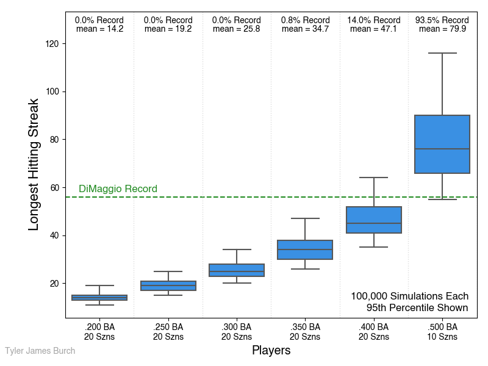
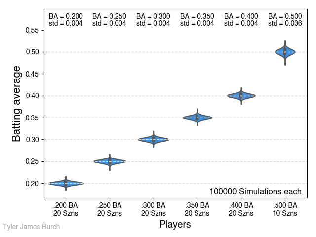

[Original problem page](https://fivethirtyeight.com/features/can-the-riddler-bros-beat-joe-dimaggios-hitting-streak/)

## Riddler Classic:

Five brothers join the Riddler Baseball Independent Society, or RBIs. Each of them enjoys a lengthy career of 20 seasons, with 160 games per season and four plate appearances per game. (To make this simple, assume each plate appearance results in a hit or an out, so there are no sac flies or walks to complicate this math.)

Given that their batting averages are .200, .250, .300, .350 and .400, what are each brother’s chances of beating DiMaggio’s 56-game hitting streak at some point in his career? (Streaks can span across seasons.)

By the way, their cousin has a .500 average, but he will get tossed from the league after his 10th season when he tests positive for performance enhancers. What are his chances of beating the streak?

### __Solution__ -

There's two steps to this problem. First, find the probability of getting a hit in a game, which is trivial knowing BA:

P(no hits) = (1 - P(hit))^n_attempts

Given: BA = P(hit)

P(no hits) = (1 - BA)^4

The next step asks "What is the probability of getting a streak of length X in attempts Y," which as it turns out, finding a closed form solution to this is not trivial - see discussion on [askamathematician](https://www.askamathematician.com/2010/07/q-whats-the-chance-of-getting-a-run-of-k-successes-in-n-bernoulli-trials-why-use-approximations-when-the-exact-answer-is-known/) and [math.stackexchange](https://math.stackexchange.com/questions/383704/probability-of-streaks).

But this is why we have computers. I wrote up a simulation to solve this problem simulating the careers of players with the indicated batting average and career length, and found how often said players would beat DiMaggio's hit streak. The results are as shown:

The likelihood of a player beating DiMaggio's record can be thought of as how frequently a simulated careers beats the record compared to the total number of simulated careers. The plot just shows the [5%, 95%] range to avoid outliers from skewing the range. The results:

- All players through the one with 0.300 have effectively no shot at beating DiMaggio's record. 
- The player with .350 BA has a 0.8% chance of beating it, so not very likely at all. On average, this batter will just have a 35 game hitting streak. 
- The player with .400 BA has a non-negligible chance of beating the record at about 14%, with an average of a 47 game hitting streak occurring during their career. 
- Even with 10 fewer seasons, the PED player will very likely beat DiMaggio's streak, about 93.5% likelihood, and on average will beat it by nearly 24 games with a mean longest streak of 79.9.

For simulation validation, the final simulated BA of each player was plotted, and ensured that it did, in fact line up with the BA in the problem statement. It did, with a coefficient of variation (std/mean) of between 0.01 and 0.02.

## Directory Content:

**simulator.py** - Simulates players for each BA and career length, then plots the resulting data, as well as validation plots. This is the entirety of the solution presented.

**fast_sim.py** - Second quick attempt at this to see if I could eliminate coding bottlenecks. It seems the major issue was in using the groupby method from itertools on a numpy array, so it did not in fact speed things up. 

