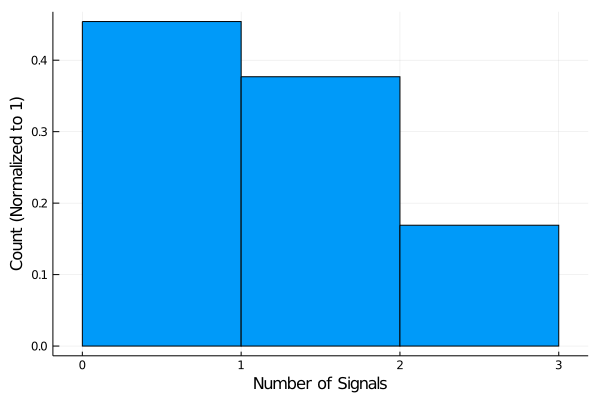
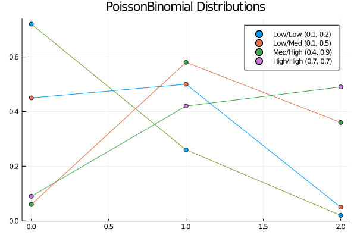
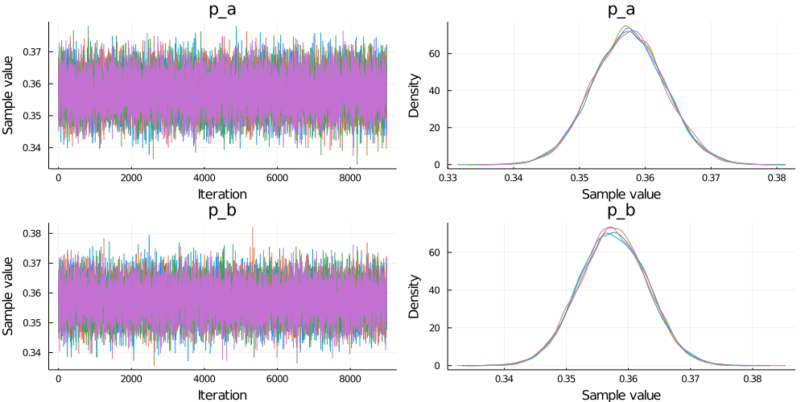

This year I've been trying to learn more about probabilistic programming and Bayesian inference. Additionally, I've been playing around with some other programming languages, R and Julia. This week's [Riddler question at FiveThirtyEight]((https://fivethirtyeight.com/features/can-you-corral-your-hamster/)) seemed like a good opportunity to utilize these things - I did this solution in Julia, using the [Turing.jl](https://turing.ml/dev/) probabilistic programming library.

## Riddler Express

>When you started your doctorate several years ago, your astrophysics lab noticed some unusual signals coming in from deep space on a particular frequency — hydrogen times tau. After analyzing a trove of data measured at many regular intervals, you compute that you heard zero signals in 45 percent of the intervals, one signal in 38 percent of the intervals and two signals in the remaining 17 percent of the intervals.

>Your research adviser suggests that it may just be random fluctuations from two sources. Each source had some fixed probability of emitting a signal that you picked up, and together those sources generated the pattern in your data.

>What do you think? Was it possible for your data to have come from two random fluctuations, as your adviser suggests?


To solve this, first I simulated observations consistent with the problem statement:

- 45% 0's
- 38% 1's
- 17% 2's

To achieve that, I threw random numbers ($n=25000$) on the interval $[0,1]$ with floating point precision. Then to achieve the proportions as designated, I set all instances on the interval $[0.00, 0.45)$ as 0, $[0.45, 0.83)$ as 1 and $[0.83, 1.00]$ as 2. This generated the following distribution of data, where the histogram is normalized to 1 in order to show rate rather than raw counts.



This histogram is consistent with the given rates, so the generated data appears valid, with 25,000 observations.

### Model

This data can be modeled using a [Poisson Binomial distribution](https://en.wikipedia.org/wiki/Poisson_binomial_distribution). This distribution is the convolution of $n$ Bernoulli distributed variables, with probability $p_1, p_2, \dots, p_n$. In our case, we have $n=2$ where each source omits a signal with probability $p_i$, for $i=1,2$ during each sampling interval.

Generic Poisson Binomial distributions with $i=2$ for various $p_i$ values are shown in the figure below.



Given two sources emitting with some fixed probability, this is the type of distribution I would expect. The distribution is bounded from 0-2, corresponding to neither source, one source, or both sources emitting during a sampling period. If both $p$ values are low, the sources aren't emitting frequently, so we expect many samplings with 0 readings. If both $p$ values are high, we expect many cases in which we receive signals from both, so many 2 readings. Anywhere in the middle, we run into a high degree of one or the other emitting a signal, so 1 is most common. This type of behavior we observe in these generic distributions, so this model seems to fit the problem.

Formalizing the model,

\begin{align*}
    y_i &\sim \text{PoissonBinomial}(\mathbf{p})\\
    p_i &\sim \text{Uniform}(0,1)\\
\end{align*}

Flat priors are used for $p_1$ and $p_2$. Given our data, we see 0 is the most common value, so most likely both $p$ values will be low, below 0.5. However, since many observations were simulated (25,000), there's flexibility to have less informative priors. With so many observations, the data will be the dominant factor in shaping the posterior. 

The flat prior, $\text{Uniform}(0,1)$, does provide information to the model in terms of bounds - on each time interval, each source has between a 0% and 100% chance of emitting. We don't permit for negative or greater than 100% probabilities, since those don't make much physical sense.


### Fitting the model

The [Turing.jl](https://turing.ml/) library is used to construct this model. 9,000 posterior samples are run on 4 chains after 1,000 sample warm-up. This is definitely overkill, but nothing else is running on my computer overnight.

The output after fitting is as follows:

```
Iterations        = 1:9000
Thinning interval = 1
Chains            = 1, 2, 3, 4
Samples per chain = 9000
internals         = acceptance_rate, hamiltonian_energy, hamiltonian_energy_error, is_accept, log_density, lp, max_hamiltonian_energy_error, n_steps, nom_step_size, numerical_error, step_size, tree_depth
parameters        = p_a, p_b

2-element Array{ChainDataFrame,1}

Summary Statistics
  parameters    mean     std  naive_se    mcse         ess   r_hat
  ──────────  ──────  ──────  ────────  ──────  ──────────  ──────
         p_a  0.3575  0.0055    0.0000  0.0000  14537.4252  1.0001
         p_b  0.3576  0.0055    0.0000  0.0000  14312.9203  1.0003

Quantiles
  parameters    2.5%   25.0%   50.0%   75.0%   97.5%
  ──────────  ──────  ──────  ──────  ──────  ──────
         p_a  0.3468  0.3537  0.3575  0.3612  0.3683
         p_b  0.3468  0.3539  0.3575  0.3613  0.3684
```

> Note: p_a and p_b are used in lieu of $p_1$ and $p_2$, by choice of personal code reading preference

There's no reason the model ought to prefer one $p$ over another, so it makes sense their mean and standard deviations are the same. The 95% credible intervals are from 0.349 to 0.368, a bit narrower than I would have expected. This means that to see the pattern we've gotten with two sources, both must have a probability of around 0.358 of emitting per sampling period.


Inspecting the chains and posteriors to make sure convergence is good:



This all looks normal, the fit appears to have worked well. Distributions appear roughly normal, centered at the above mean of 0.358 for both. Probably the most interesting check is how the probabilities covary. 

This solution approach searches for possible parameter values that can realize the observations. Meaning, to get the same observations, as one $p$ value increases, the other $p$ value ought to decrease. In other words, if one source is emitting signals more often, to get the same realized data, the other source must emit less often. Thus, we expect a negative correlation between the two emission probability parameters.


In fact, the parameters do have a negative correlation, -0.697.

### Final Solution

Getting back to the question posed:

>Your research adviser suggests that it may just be random fluctuations from two sources. Each source had some fixed probability of emitting a signal that you picked up, and together those sources generated the pattern in your data.

>What do you think? Was it possible for your data to have come from two random fluctuations, as your adviser suggests?

This analysis shows, yes, this is definitely possible. If it were true, we would expect both sources to have between a 34.7% and 36.8% probability of emitting a signal each sampling period, the 95% credible interval. The mean emission probability per sampling period we expect from either source 35.8%, with a standard deviation of 0.6%.

### Investigating Extrema

With so many posterior samples, its interesting from a sheer curiosity standpoint to look at the most extreme values that could result in this dataset. If one is emitting with the highest possible probability to realize this data, what is that probability? Subsequently, how infrequent would the other have to emit in this scenario?

The highest emission probability consistent with our data was found to be $p = 0.382$, where the corresponding probability from the second source is $p = 0.344$ (outside the lower limits of the 95% credible interval, expected due to covariance).

The lowest emission probability was found to be $p=0.335$, with a corresponding probability from the second source of $p=0.378$ (outside upper limits of 95% credible credible interval).

As mentioned, these are the most extreme values, so very, very unlikely to be realized, and we should lend effectively no belief to values below $p=0.33$ or above $p=0.39$.