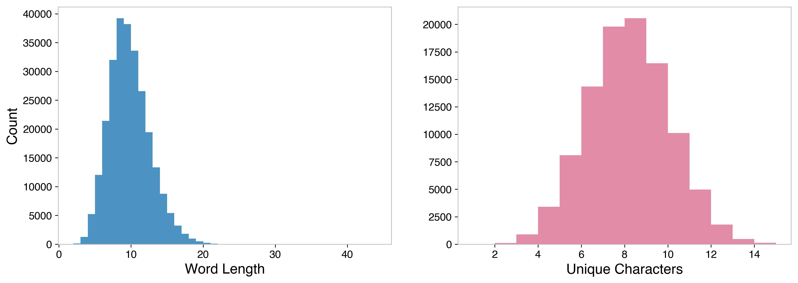
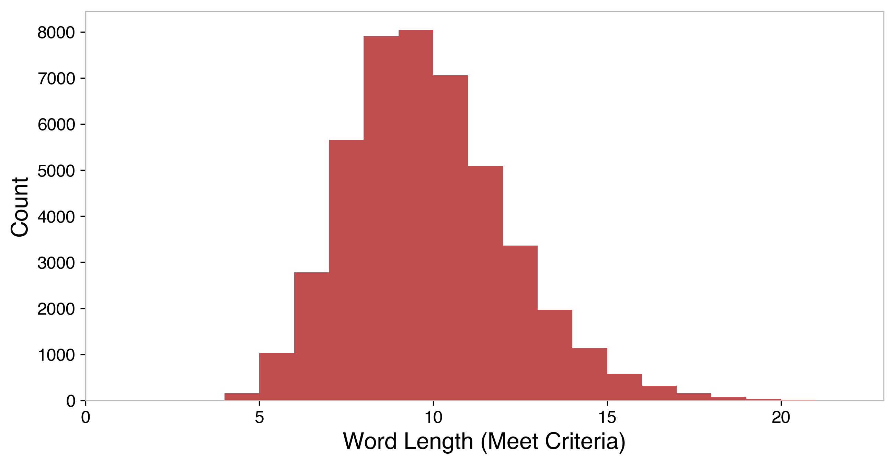

[Original problem page](https://fivethirtyeight.com/features/somethings-fishy-in-the-state-of-the-riddler/)


## Riddler Classic:

> Ohio is the only state whose name doesn’t share any letters with the word “mackerel.” It’s strange, but it’s true.

> But that isn’t the only pairing of a state and a word you can say that about — it’s not even the only fish! Kentucky has “goldfish” to itself, Montana has “jellyfish” and Delaware has “monkfish,” just to name a few.

> What is the longest “mackerel?” That is, what is the longest word that doesn’t share any letters with exactly one state? (If multiple “mackerels” are tied for being the longest, can you find them all?)

> Extra credit: Which state has the most “mackerels?” That is, which state has the most words for which it is the only state without any letters in common with those words?


* The way this problem is worded lends to a lot of double negatives in describing this work, so I've used the terminology of a "mackerel" for words that meet the problem criteria of sharing characters with all states but one.

## __Solution__ -


First things first, I downloaded the data linked in the original problem statement, Peter Norvig's [word list](https://norvig.com/ngrams/word.list), and created a list of state names. Before diving into the solution, I took an exploratory look at the data, looking at word lengths. There are 263,533 words in total, with the mean word length being 9.3, median of 9, and standard deviation of 2.9. The longest word included in the dataset is "pneumonoultramicroscopicsilicovolcanoconiosis," which according to [dictionary.com](https://www.dictionary.com/browse/pneumonoultramicroscopicsilicovolcanoconiosis), is 

>An obscure term ostensibly referring to a lung disease caused by silica dust, sometimes cited as one of the longest words in the English language.

 In essence, that's not really the question we're worried about. For the comparison we're making, we're interested in the number of _unique_ characters in each word. Those figures are lower than the total dataset - the mean is 7.71, median is 8, and standard deviation is 1.9. Further, that's just 101,137 unique character sets.



The word with the most unique characters is "phenylthiocarbamides," which uses an impressive 20 out of the 26 letters in the alphabet. According to [wikipedia](https://en.wikipedia.org/wiki/Phenylthiocarbamide), this is

> Phenylthiocarbamide (PTC), also known as phenylthiourea (PTU), is an organosulfur thiourea containing a phenyl ring.

> It has the unusual property that it either tastes very bitter or is virtually tasteless, depending on the genetic makeup of the taster. 

Next, I went ahead and tackled the problem at hand. I wrote a function in python that compared each word against each state. If the word doesn't share characters with one and only one state, the function returns that state, otherwise it returns a ```None```, which is used in a simple logic flow to solve the subsequent problems. To manage computation time, I tried to escape this function as quickly as possible - as soon as it doesn't share words with two states, it isn't a "mackerel" candidate so ```None``` is returned indicating that it's failed. 

For the first part of the problem, I need to find the length of the longest word that meets the "mackerel" criteria. I start at the longest word, and work my way to shorter words until the criteria is met. The function stopped at "Hydrochlorofluorocarbon," which shares no letters with just the state of Mississippi. Since that is length 23, I then rerun the function for all words of that length to check for any ties, which there was one, so the solution to the problem is:

### There are **2** words of length **23** who don't share letters with _exactly_ one state. The two words are:

- **Counterproductivenesses** which doesn't share letters with **Alabama**
- **Hydrochlorofluorocarbon** which doesn't share letters with **Mississippi**

From there, I removed the stopping condition once a match was found, and reran for the full dataset (I found computationally, this problem was manageable, so this ran quickly). I found 45,385 words that met the criteria of sharing letters with all but one state. These words match the total population well, the mean word length is similar at 9.37.



Next, I look at the extra credit portion of the question - which state has the most words which don't share letters with only it. The way I set up the function to check if a word was a "mackerel," it returned the name of the state which it shared no letters with; this return was designed to solve this part of the problem. I summed the counts for each state and found the following results:


This gives us the solution that:

### **Ohio** has the most "mackerels," words that don't share letters with only that state, at **11,342** words.

One note here is that four states with the most "Mackerels" are Ohio (11,342), Alabama (8,274), Utah (6,619), and Mississippi (4,863). These are notable because they have 3, 4, 4, and 4 _unique_ letters in them, respectively. This gets back to something I mentioned earlier: the real question here is how many _unique_ characters are in each. So I took a look at the correlation between number of "mackerels," the words that don't share letters with only that state, and the number of unique characters in the state name. 


As expected, these exhibit a negative correlation, to the tune of -0.53, meaning the more unique characters a state has, the fewer of these words we expect. The states with the fewest number of "mackerels" both have 7 unique characters, Connecticut (9 "mackerels") and Michigan (7 "mackerels"). The states with the most unique characters are North Dakota and New Mexico, each with 9 unique characters. As expected, both of these are in the bottom 6 in terms of number of "mackerels," with 54 and 30 respectively.


## Directory Content:

**python/data-download.py** - Gets the data, both the wordlist and statelist and saves as pickle files.

**python/puzzle-solution.ipynb** - Jupyter notebook where data is analyzed and the plots shown here are made.


