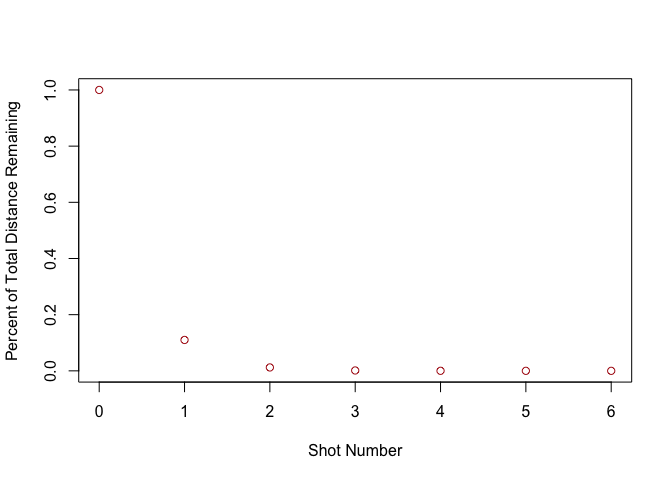
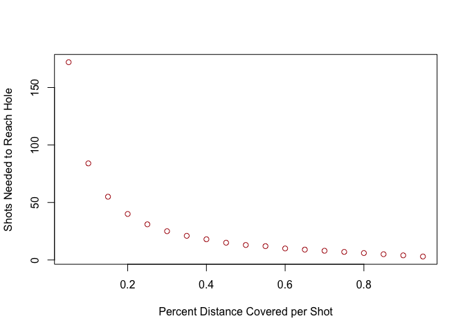

# Riddler Express

>From Dan Levin comes a hazardous riddle for the ironclad and eagle-eyed:

>The U.S. Open concluded last weekend, with physics major Bryson DeChambeau emerging victorious. Seeing his favorite golfer win his first major got Dan thinking about the precision needed to be a professional at the sport.

>A typical hole is about 400 yards long, while the cup measures a mere 4.25 inches in diameter. Suppose that, with every swing, you hit the ball X percent closer to the center of the hole. For example, if X were 75 percent, then with every swing the ball would be four times closer to the hole than it was previously.

>For a 400-yard hole, assuming there are no hazards (water, sand or otherwise) in the way, what is the minimum value of X so that you’ll shoot par, meaning you’ll hit the ball into the cup in exactly four strokes?

I solved this one analytically. Unfortunately, GitHub's markdown does not render TeX equations well, so the analytical solution can be found [on my blog](http://tylerjamesburch.com/blog/misc/fivethirtyeight_golf_percentages) - ultimately the answer is ~89% of the total distance per shot. Also, I wrote up the TeX as well as the plots in the .Rmd file, `2020-09-25-fivethirtyeight_golf_percentage.Rmd`.

I wrote up some simple plots to further investigate the solution, first, looking at the distance remaining as a function of shots for a "par-level" player (meaning, a player who covers 89% of the remaining distance per shot),

Next, I also took a look at the number of strokes taken in order to make it into a hole at 400 yards for various distances covered per shot,

